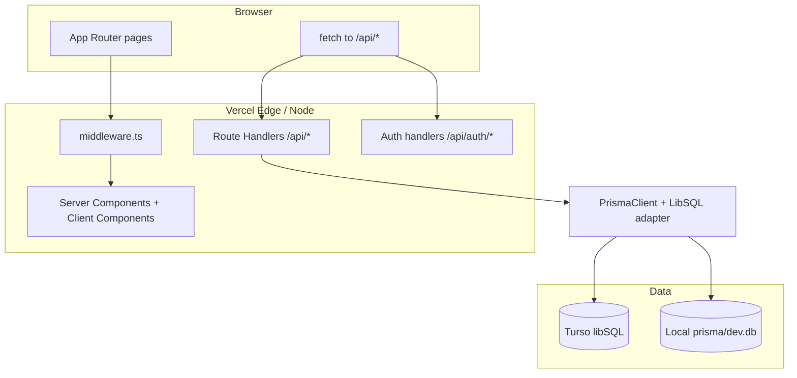

# Architecture

## High-level system

DevaDutta Hub is a **server-rendered and API-driven Next.js** application deployed on **Vercel**. The browser talks to **Next.js Route Handlers** and **React Server Components** where applicable. **Auth.js (NextAuth v5)** guards private areas. **Prisma ORM 7** with the **LibSQL driver adapter** persists data to **Turso** in production and to a **local SQLite file** in development.



## Request paths

### Public marketing

- **`/`** — Landing page; no session required.

### Authentication

- **`/login`** — Google sign-in via server action calling `signIn("google")`.
- **`/api/auth/[...nextauth]`** — Auth.js HTTP handlers (`GET` / `POST`) from `handlers` in `src/auth.ts`.
- OAuth callback: **`/api/auth/callback/google`** (must be registered in Google Cloud Console for each deployed host).

### Protected UI

- **`/middleware.ts`** — Matcher: `/dashboard/:path*`, `/login`.
  - Unauthenticated user hitting **`/dashboard/*`** → redirect to **`/login?callbackUrl=…`**.
  - Authenticated user hitting **`/login`** → redirect to **`/dashboard`**.

### Protected APIs

All business APIs require a valid session via **`auth()`** inside the handler:

| Method | Path | Role |
|--------|------|------|
| GET/POST/DELETE | `/api/health` | Health entries CRUD |
| GET/POST/PATCH/DELETE | `/api/ideas` | Saved ideas CRUD |
| GET | `/api/debug/db` | Authenticated DB health + table row counts |
| GET | `/api/ping` | Liveness (no DB) |

### Prisma entry point

- **`src/lib/prisma.ts`** — Single `PrismaClient` instance (cached on `globalThis` for serverless). Chooses **Turso** when `TURSO_DATABASE_URL` is set; otherwise **`file:`** SQLite under `prisma/dev.db`.

## Directory map (source)

```
src/
  app/
    page.tsx                 # Public home
    login/page.tsx           # Sign-in
    layout.tsx               # Root layout
    not-found.tsx
    dashboard/
      layout.tsx             # Sidebar shell
      page.tsx               # Dashboard home
      ideas/page.tsx         # Idea lab UI
      health/page.tsx        # Health hub UI
      SidebarClient.tsx
      SignOutButton.tsx
    api/
      auth/[...nextauth]/route.ts
      health/route.ts
      ideas/route.ts
      ping/route.ts
      debug/db/route.ts
  auth.ts                    # NextAuth configuration
  middleware.ts
  lib/
    prisma.ts                # Prisma + LibSQL
    utils.ts                 # cn() etc.
prisma/
  schema.prisma
  migrations/
prisma.config.ts             # Prisma CLI datasource (local file)
scripts/
  seed-ideas.mjs
  apply-turso-schema.mjs
  idea-prompt.md
  ideas-output.json
.github/workflows/ci.yml
next.config.ts               # Security headers + CSP
```

## Data flow (write)

1. User submits a form or triggers an action in **`/dashboard/*`**.
2. Client **`fetch`**es **`/api/ideas`** or **`/api/health`** with credentials (cookies).
3. Route handler calls **`await auth()`** → 401 if no session.
4. Handler calls **`prisma.*.create` / `update` / `delete`**.
5. LibSQL adapter executes SQL against **Turso** (prod) or **local file** (dev).

## Build-time vs runtime

- **`prisma generate`** runs during **`npm run build`** (and seed script). Output: **`src/generated/prisma/`** (gitignored). TypeScript imports **`@/generated/prisma/client`**, not `@prisma/client` for the app instance.
- **Vercel** does not ship `prisma/dev.db`; production **must** have Turso env vars and remote schema.

## Future notes

- Next.js may deprecate the **`middleware`** file convention in favor of **`proxy`**; track [middleware-to-proxy](https://nextjs.org/docs/messages/middleware-to-proxy) when upgrading.
